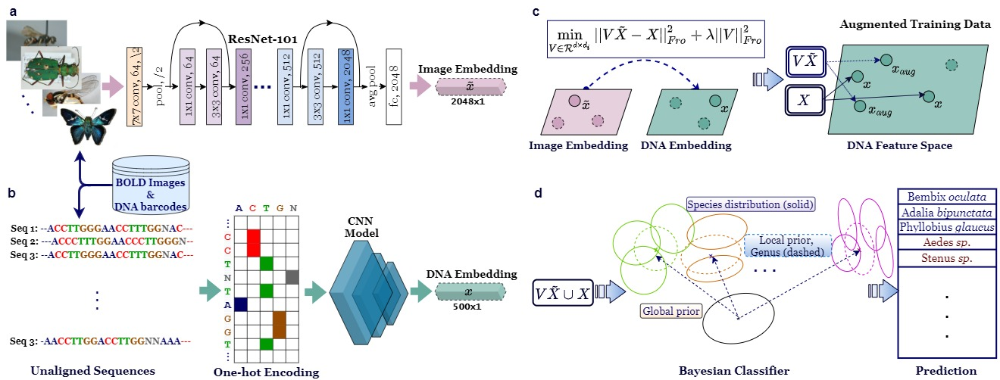

# Zero-shot Insect Discovery.

GitHub repo for our paper "Classifying the Unknown: Identification of Insects by Deep Zero-shot Bayesian Learning" 

Paper at: [bioRxiv](https://www.biorxiv.org/content/10.1101/2021.09.15.460492v1)

Insects represent a large majority of biodiversity on Earth, yet only 20\% of the estimated 5.5 million insect species are currently described. We developed a Bayesian deep learning method for the open-set classification of species. The proposed approach forms a Bayesian hierarchy of species around corresponding genera and uses deep embeddings of images and barcodes together to identify insects at the lowest level of abstraction possible. To demonstrate proof of concept, we used a database of 32,848 insect instances from 1,040 described species split into training and test data. The test data included 243 species not present in the training data. Our results demonstrate that using DNA sequences and images together, insect instances of described species can be classified with 96.66% accuracy while achieving accuracy of 81.39% in identifying genera of insect instances of undescribed species. The proposed deep zero-shot Bayesian model demonstrates a powerful new approach that can be used for the gargantuan task of identifying new insect species.

  

## Notes
Please see the ReadMe files inside of the relevant folders, `Bayesian classifier` and `DNA embeddings`, for the instructions to run experiments.
